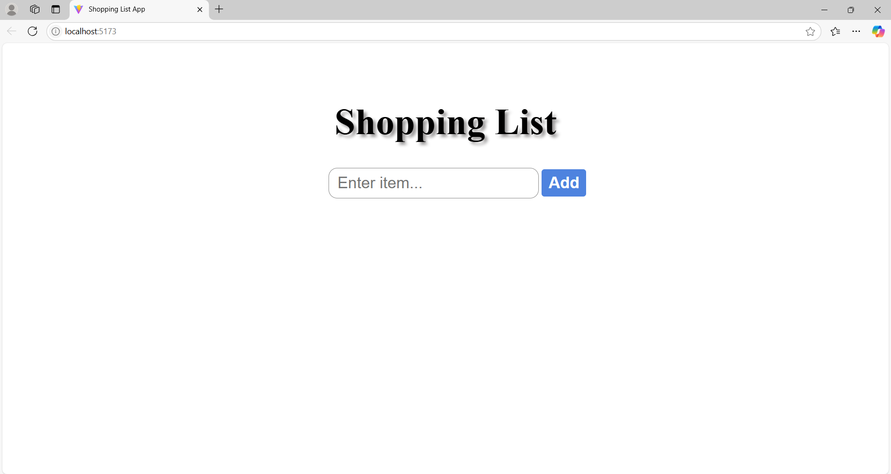

# Shopping List App

A simple, beginner-friendly React app to manage your shopping list. This app allows users to add items, mark them as bought or to-buy, and delete items from the list. The app is styled for responsiveness and provides a user-friendly interface.

## Features

- Add items to your shopping list.
- Mark items as "Bought" or "To Buy."
- Delete items from the list.
- Visual feedback with dynamic button colors.
- Responsive design for different screen sizes.

## Technologies Used

- **React**: Frontend framework for building the user interface.
- **CSS**: Styling for the app layout and responsiveness.
- **JavaScript**: Logic and functionality.

## Demo

Here’s how the app looks in action:

### Screenshots

1. **Home Screen**
   
    

2. **Adding an Item**
   
    

3. **Toggling the Status of Button**
   
    

Happy shopping! 🛒
